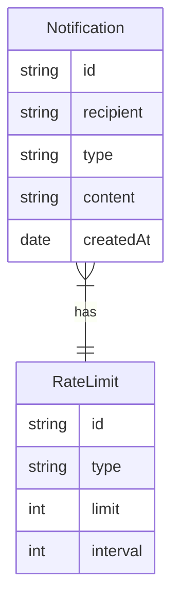

# Challenge

## Specification
We have a Notification system that sends out email notifications of various types (status update, daily news, project invitations, etc). We need to protect recipients from getting too many emails, either due to system errors or due to abuse, so let’s limit the number of emails sent to them by implementing a rate-limited version of NotificationService.
The system must reject requests that are over the limit.
Some sample notification types and rate limit rules, e.g.:

- Status: not more than 2 per minute for each recipient
- News: not more than 1 per day for each recipient
- Marketing: not more than 3 per hour for each recipient
Etc. these are just samples, the system might have several rate limit rules!

## Running the application
### Building the application with Docker

```sh
docker-compose build

```

### Running the application with Docker

```sh
docker-compose up
```

## Data Model

There are two types of data models: Notification and RateLimit.

